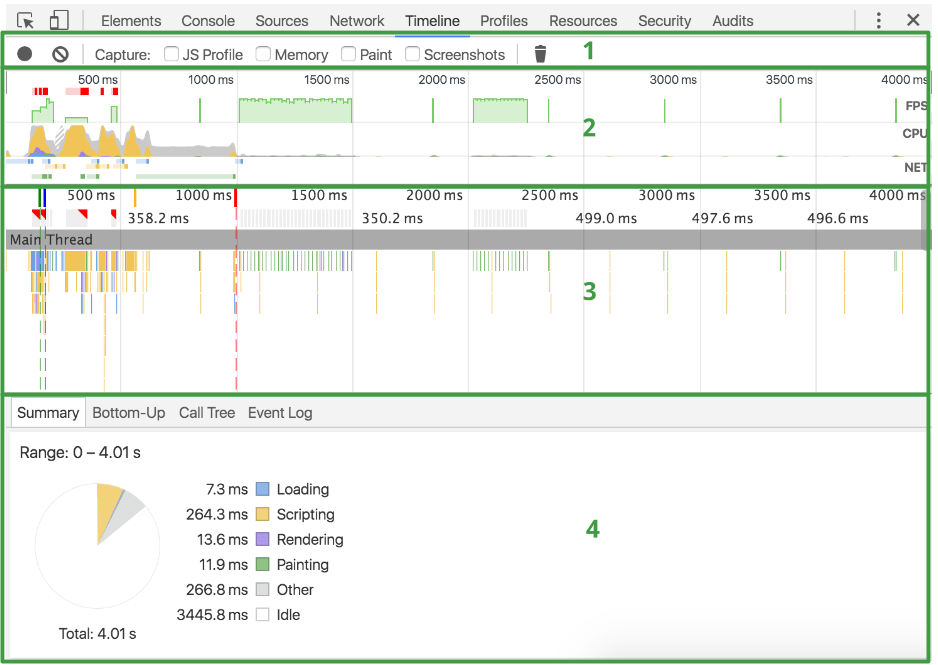

# Chrome 性能分析

### 目录
    1. 准备工作
    2. 分析报告
    3. 了解FPS
    4. 定位瓶颈
    5. 小功能-显示实时FPS面板
    6. 链接

### 准备工作
```
1. 打开Chrome的匿名模式（快捷键：Command + shift + N）。匿名模式可以保证Chrome在一个相对干净的环境下运行。比如说，你安装了许多chrome插件，这些插件可能会影响我们分析性能表现。

2. 打开链接，[DEMO](https://googlechrome.github.io/devtools-samples/jank/)，这个网页就是我们要用来分析的DEMO。这个页面里都是很多上下移动的蓝色小方块。

3. 打开Devtools（快捷键：Command + Option + i）
```


```
4. 模拟移动设备的CPU
    移动设备的CPU一般比笔记本弱很多，分析页面时可以用CPU控制台来模拟移动设备的CPU。

    1）在DevTools中，点击Performance的tab

    2）勾选ScreenShots checkbox

    3）点击 Capture Settings（⚙️）按钮，点击CPU选项，选择4x slowdown，于是DevTools就开始模拟4倍低速CPU
```


### 分析报告
```
1. 点击ReCord, 开始录制⏺️性能指标。
```


```
2. 等待几分钟，点击stop按钮，DevTools定制录制，显示性能报告。
```


```
3. performance面板功能分析

    performance面板包含以下四个窗格：
    
        1） controls。开始记录，停止记录和配置记录期间捕获的信息

　　     2） overview。页面性能的高级汇总

    　　 3） 火焰图。 CPU 堆叠追踪的可视化

    　　 4） 统计汇总。以图表的形式汇总数据

    彩色表示：
        HTML文件为蓝色。
        脚本为黄色。
        样式表为紫色。
        媒体文件为绿色。
        其他资源为灰色。
    
查看面板：
    [Overview]

        OverViewc包含了三个图表：

        1）FPS：每秒帧数。绿色竖线越高，FPS 越高。 FPS 图表上的红色块表示长时间帧，很可能会出现卡顿。

        2）CPU：CPU 资源。此面积图指示消耗 CPU 资源的事件类型。

        3）NET：每条彩色横杠表示一种资源。横杠越长，检索资源所需的时间越长。 每个横杠的浅色部分表示等待时间（从请求资源到第一个字节下载完成的时间）


    [火焰图]

        在火焰图上看到一到三条垂直的虚线。蓝线代表 DOMContentLoaded 事件。 绿线代表首次绘制的时间。 红线代表 load 事件。
        在火焰图中选择事件时，Details 窗格会显示与事件相关的其他信息

        (绿线：frame started loading)

        (蓝线：DOMContentLoaded)

        (红线：load)

```



### 了解FPS
```
    帧率是用于测量显示帧数的量度。测量单位为“每秒显示帧数”（Frame per Second，FPS）或“赫兹”，一般来说FPS用于描述影片、电子绘图或游戏每秒播放多少帧。

    帧率 : 每秒显示帧数（Frame per Second，FPS）

    12 fps：当画面帧率高于每秒约10-12帧的时候，就会认为是连贯的，此现象称之为视觉暂留，动画的原理就基于此.

    24 fps：有声电影的拍摄及播放帧率均为每秒24帧，对一般人而言已可接受

    30 fps：早期的高动态电子游戏，帧率少于每秒30帧的话就会显得不连贯

    60 fps：在实际体验中，60帧相对于30帧有着更好的体验

    85 fps：大脑处理视频的极限,人眼无法分辨85fps与更高帧率的差异

```

### 定位瓶颈
```
1. Summary面板，会发现CPU花费了大量的时间在rendering上。因此目标就是减少rendering的时间。
```

```
2. 展开Main图表，Devtools展示了主线程运行状况。X轴代表着时间。每个长条代表着一个event。长条越长就代表这个event花费的时间越长。Y轴代表了调用栈（call stack）。在栈里，上面的event调用了下面的event。
```

```
3. 在事件长条的右上角出，如果出现了红色小三角，说明这个事件是存在问题的，需要特别注意。
```

```
4. 点击这个带有红色小三角的的事件。在Summary面板会看到详细信息。注意reveal这个链接，双击它会让高亮触发这个事件的event。如果点击了app.js:94这个链接，就会跳转到对应的代码处。
```

```
5. 在summary面板里点击app.js:70链接，Devtools会跳转到需要优化的代码处
```


### 小功能-显示实时FPS面板
```
一个好用的小工具就是实时FPS面板，它可以实时展示页面的FPS指标
1. 按下 Command + Shift + P 打开命令菜单
2. 输入Rendering，点选Show Rendering
3. 在Rednering面板中，激活FPS Meter。 FPS实时面板就会出现在页面的右上方。
```


### 链接
demo: https://googlechrome.github.io/devtools-samples/jank/

如何使用 Timeline 工具
: https://developers.google.com/web/tools/chrome-devtools/evaluate-performance/timeline-tool?hl=zh-cn

避免大型、复杂的布局和布局抖动: https://developers.google.com/web/fundamentals/performance/rendering/avoid-large-complex-layouts-and-layout-thrashing#avoid-forced-synchronous-layouts

构建对象模型: https://developers.google.com/web/fundamentals/performance/critical-rendering-path/constructing-the-object-model
