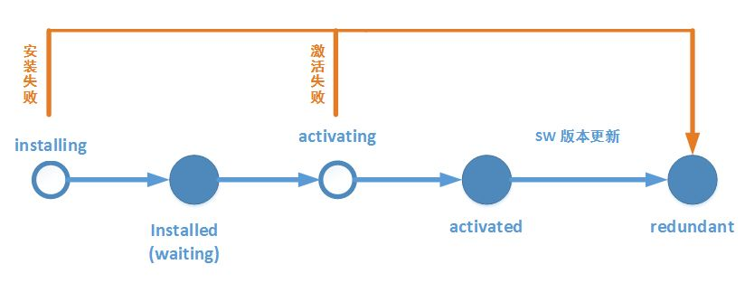
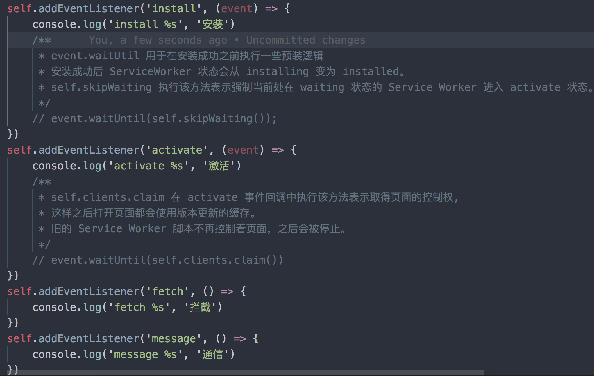
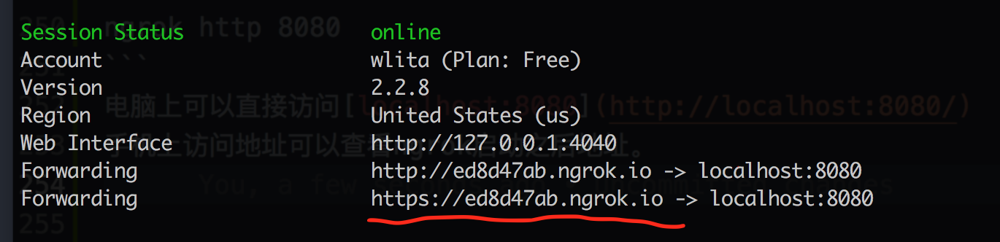
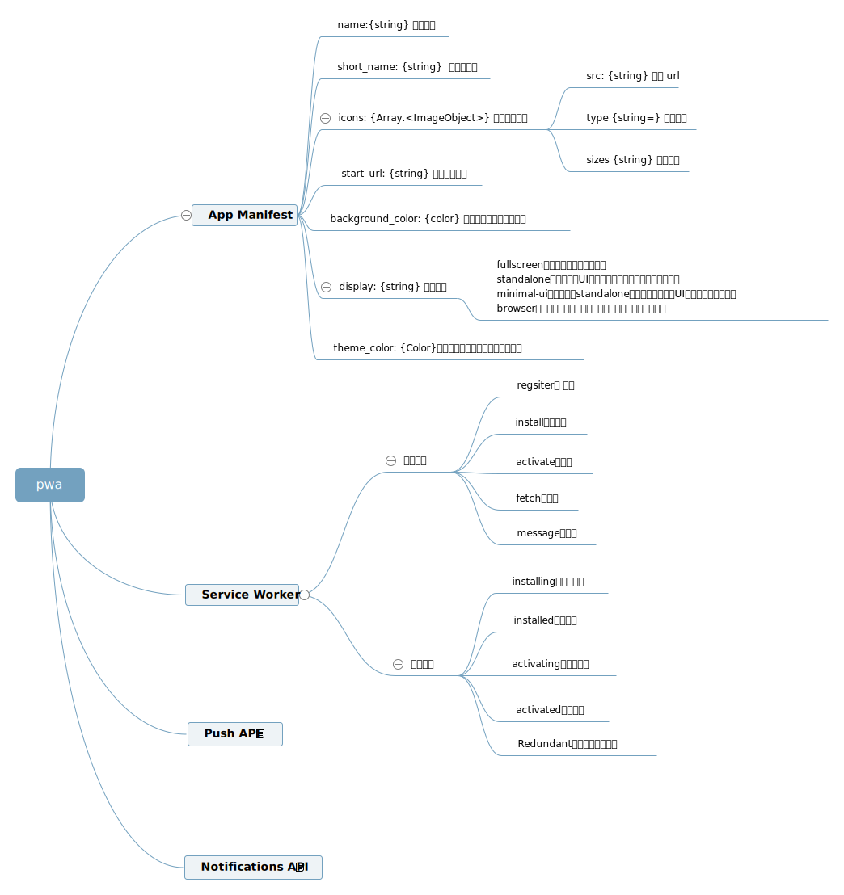

# PWA 介绍

### 目录
    1. PWA 简单介绍
    2. Service Worker 实现离线缓存
    3. Manifest 实现添加至主屏幕
    4. demo
    5. 参考链接


### 1. PWA 简单介绍
```
PWA 全称 Progressvie Web App，即渐进式增强WEB应用。

PWA 功能：
    1. 可安装：可以像原生APP在主屏幕上留有图标。
    2. 离线缓存：即使用户手机没有网络，依然可以使用一些离线功能
    3. 消息推送

PWA是应用一系列技术组成的集合, 其核心技术包括 App Manifest、Service Worker、Web Push等。
```

### 2. Service Worker 实现离线缓存

#### 2.1 什么是Service Worker
```
service worker是独立于当前页面的运行在浏览器后台进程的脚本。它可以拦截页面请求、缓存文件。
```


#### 2.2 service worker 功能特性
```
1. 要求页面必须是Https（开发过程中一般浏览器也允许host为 localhost 或 127.0.0.1）
2. 可以拦截作用域（可以指定，默认是当前server worker文件所在的目录）范围内的所有请求
3. 不能操作DOM，但可以通过postMessage与页面通信
4. 一旦被 install，就永远存在，除非被手动 unregister
5. Service Worker 的缓存机制是依赖 Cache API实现的
```

#### 2.3 service worker生命周期

```
service worker 包含以下几个生命周期
1、安装（installing）：发生在 Service Worker 注册之后，表示开始安装，触发 install 事件回调指定一些静态资源进行离线缓存， install 事件回调中有两个方法：
    1) event.waitUntil()：传入一个 Promise 为参数，等到该 Promise 为 resolve 状态为止。
    2) self.skipWaiting()：执行该方法表示强制当前处在 waiting 状态的 Service Worker 进入 activate 状态。
2、已安装（installed）：安装完成，等待其他的 Service Worker 线程被关闭。
3、正在激活（activating）：处于 activating 状态期间，Service Worker 脚本中的 activate 事件被执行。 我们通常在 activate 事件中，清理 cache 中的文件。 activate 回调中有以下两个方法：
    1）event.waitUntil()：传入一个 Promise 为参数，等到该 Promise 为 resolve 状态为止。
    2）self.clients.claim()：在 activate 事件回调中执行该方法表示取得页面的控制权, 这样之后打开页面都会使用版本更新的缓存。旧的 Service Worker 脚本不再控制着页面，之后会被停止。
4、已激活（activated）：在这个状态会处理 activate 事件回调 (提供了更新缓存策略的机会)。并可以处理功能性的事件 fetch (请求)、 sync (后台同步)、 push (推送)等。
5、废弃状态（Redundant）：这个状态表示一个 Service Worker 的生命周期结束。进入废弃 ( redundant ) 状态的原因可能为这几种：
    安装 ( install ) 失败
    激活 ( activating ) 失败
    新版本的 Service Worker 替换了它并成为激活状态
```
#### 2.4 service worker主要事件



### 3. Manifest 实现添加至主屏幕

#### 3.1 Manifest是什么？
```
manifest 的目的是将Web应用程序安装到设备的主屏幕，为用户提供更快的访问和更丰富的体验。
```

#### 3.2 标准现状

当前 manifest.json 的标准仍属于草案阶段，Chrome 和 Firefox 已经实现了这个功能，微软正努力在 Edge 浏览器上实现，Apple 目前仍在考虑中。具体请查阅 [caniuse.com](https://caniuse.com/#search=manifest) 来查看主流浏览器的支持情况。同时需要注意的是，manifest.json 目前仍属于实验性技术，所以其部分属性和功能在未来有可能会发生改变。
目前如果修改了 manifest.json 的应用名称，已添加到主屏幕的名称并不会改变，只有当用户重新添加到桌面时，更改后的名称才会显示出来。但是在未来版本的 Chrome 浏览器将支持自动更新。


#### 3.3 安装 Web App 到主屏幕条件

    站点支持 HTTPS 访问;

    站点部署 manifest.json;

    站点注册 Service Worker;


#### 3.4 Manifest 添加到屏幕
```
1. 在页面head区域引入文件：
    <link rel= "manifest" href= "manifest.json" />

2. 在项目根目录创建manifest.json文件，内容如下：
    {
        "short_name": "短名称",
        "name": "这是一个完整名称",
        "icon": [
            {
                "src": "icon.png",
                "type": "image/png",
                "sizes": "48x48"
            }
        ],
        "start_url": "index.html"
    }
```

#### 3.5 设置 IOS Safari 上的添加至主屏幕元素
```
应用图标： 
< link rel= "apple-touch-icon" href= "apple-touch-icon.png" > 
启动画面： 
< link rel= "apple-touch-startup-image" href= "launch.png" > 
应用名称： 
< meta name= "apple-mobile-web-app-title" content= "Todo" > 
全屏效果： 
< meta name= "apple-mobile-web-app-capable" content= "yes" > 
设置状态栏颜色： 
< meta name= "apple-mobile-web-app-status-bar-style" content= "#fff" >
```


### 4. demo

#### 4.1 准备工作
安装[http-server](https://www.npmjs.com/package/http-server)和[ngrok](https://ngrok.com/)方便调试和查看.
http-server 可以启动一个本地服务，方便在电脑上调试。ngrok 可以将本地服务穿透到外网，方便手机调试。

创建文件
```
touch index.html manifest.json sw.js
```

index.html
```
<head>
    <title>PWA</title>
    <meta name="viewport" content="width=device-width, user-scalable=no" />
</head>
<body>
    <h3>hello PWA</h3>

    <script>
        if (navigator.serviceWorker != null) {
            navigator.serviceWorker.register('sw.js')
            .then(function(registration) {
                console.log('Registered events at scope: ', registration.scope);
            });
        }
    </script>
</body>
```

manifest.json
```
{
    "short_name": "短名称",
    "name": "这是一个完整名称",
    "icon": [
        {
            "src": "icon.png",
            "type": "image/png",
            "sizes": "48x48"
        }
    ],
    "start_url": "index.html"
}
```

sw.js
```
// 用于标注创建的缓存，也可以根据它来建立版本规范
const CACHE_NAME = "v1.1.0"
// 列举要默认缓存的静态资源，一般用于离线使用
const initCache = [
    '/',
    'icon.png'
]

// self 为当前 scope 内的上下文
self.addEventListener('install', event => {
    // event.waitUtil 用于在安装成功之前执行一些预装逻辑
    // 但是建议只做一些轻量级和非常重要资源的缓存，减少安装失败的概率
    // 安装成功后 ServiceWorker 状态会从 installing 变为 installed
    event.waitUntil(
        // 使用 cache API 打开指定的 cache 文件
        caches.open(CACHE_NAME).then(cache => {
            console.log('adding to cache:', initCache);
            // 添加要缓存的资源列表
            return cache.addAll(initCache);
        }).then(() => {
            console.log('Skip waiting!')
            return self.skipWaiting()
        })
    );
});

self.addEventListener('activate', function (event) {
    event.waitUntil(
        Promise.all([
            // 清理旧版本
            caches.keys().then(cacheNames => {
                return cacheNames.map(name => {
                    if (name !== CACHE_NAME) {
                        return caches.delete(name)
                    }
                })
            })
        ]).then(() => {
            // 更新客户端
            return self.clients.claim()
        })
    );
});

self.addEventListener('fetch', function (event) {
    event.respondWith(
        caches.match(event.request).then(function (response) {
            // 来来来，代理可以搞一些代理的事情

            // 如果 Service Worker 有自己的返回，就直接返回，减少一次 http 请求
            if (response) {
                return response;
            }

            // 如果 service worker 没有返回，那就得直接请求真实远程服务
            var request = event.request.clone(); // 把原始请求拷过来
            return fetch(request).then(function (httpRes) {

                // 请求失败了，直接返回失败的结果就好了。。
                if (!httpRes || httpRes.status !== 200) {
                    return httpRes;
                }

                // 请求成功的话，将请求缓存起来。
                var responseClone = httpRes.clone();

                caches.open(CACHE_NAME).then(function (cache) {
                    cache.put(event.request, responseClone);
                });

                return httpRes;
            });
        })
    );
});
```


执行命名
```
http-server -c-1   # -c-1设置关闭缓存
# 用另一个终端
ngrok http 8080
```
电脑上可以直接访问[localhost:8080](http://localhost:8080/)
手机上访问地址可以查看ngrok启动之后地址。



### 5. 参考链接
https://lavas.baidu.com/pwa/README
https://jdc.jd.com/archives/212666


### 参考api
