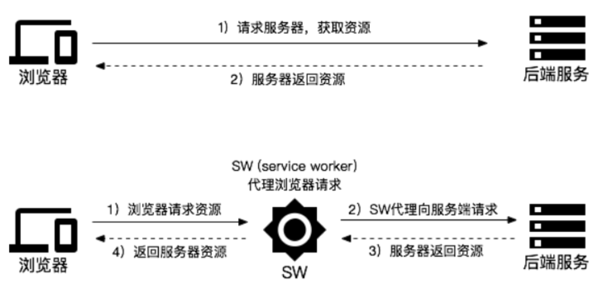

# PWA 介绍

### 目录
    1. PWA 简单介绍
    2. Service Worker 实现离线缓存
    3. Manifest 实现添加至主屏幕
    4. 如何调试
    5. 链接


### PWA 简单介绍
```
PWA 全称 Progressvie Web App，即渐进式增强WEB应用。

PWA 功能：
    1. 可安装：可以像原生APP在主屏幕上留有图标。
    2. 离线缓存：即使用户手机没有网络，依然可以使用一些离线功能
    3. 消息推送

PWA是应用一系列技术组成的集合, 其核心技术包括 App Manifest、Service Worker、Web Push等。
```

### Service Worker 实现离线缓存

#### 1. 什么是Service Worker
```
service worker是独立于当前页面的运行在浏览器后台进程的脚本。它可以拦截页面请求、缓存文件。
```



```
service worker 功能特性：
    1. 要求页面必须是Https（开发过程中一般浏览器也允许host为 localhost 或 127.0.0.1）
    2. 可以拦截作用域（可以指定，默认是当前server worker文件所在的目录）范围内的所有请求
    3. 不能操作DOM，但可以通过postMessage与页面通信
    4. 一旦被 install，就永远存在，除非被手动 unregister
    5. Service Worker 的缓存机制是依赖 Cache API实现的
```

```
service worker 生命周期：
    
```